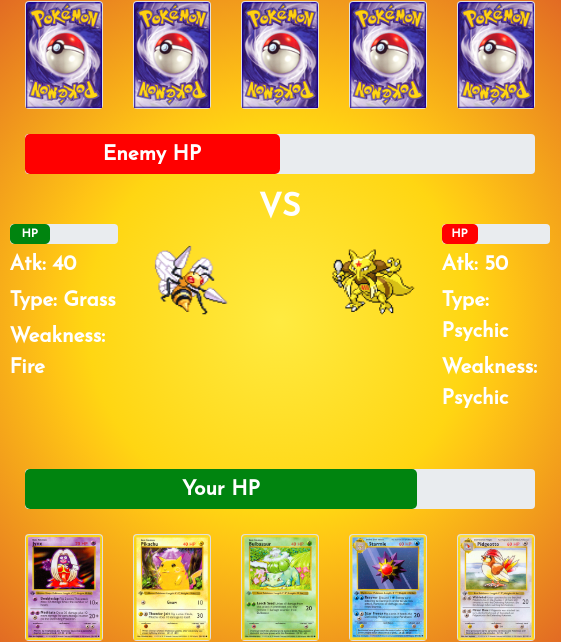

README

This is a Pokemon Trading Card Battle game. You will take it up to the computer. Each of you will receive five cards in a deck, and a side deck. Every time you pick a Pokemon to battle, a new Pokemon will take it’s place. The player and computer both have a HP-bar. The game starts with 1000 HP points, the goal is to beat your player to 0 before you get there.

The first key was hit on monday 16 sept. 2019 and the last one fell on friday 20 sept. 2019. Our team of five:

	- Mehdi Annouri			https://github.com/MehdiAnn
	- Mouad Soufiani		https://github.com/MouadSoufiani
	- Robin Mariën			https://github.com/RobinMarien
	- Tim				https://github.com/Timmeahi
	- Barend Stroobants		https://github.com/BarendStroobants

Our team worked hard for five day’s on 3 pages, the landing page / homepage,a about us page, and the arena. Mouad put all his knowledge in the homepage and about us page. Mehdi and Barend worked on the styling of the arena. Robin and Tim build the javascript. Not bad for 5 student junior web-developers, right!?

What does it look like?

Both players are placed across from each other. In the middle you see 2 Pokemon,  both with their own HP-bar, and stats like Atk and Type. At the bottom of the screen you’ll see your HP-bar and your 5 cards. At the top is the computer. It was a fun exercise and we’re past the deadline, but like every web-developer would say; there is no such thing as “finished”.

Enjoy this Pokemon Trading Card Battle game!
https://timmeahj.github.io/pokemon-tgc/index.html
